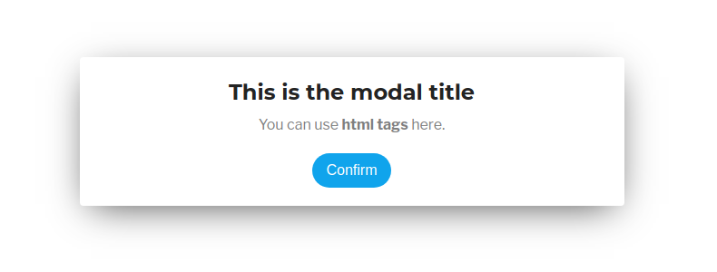
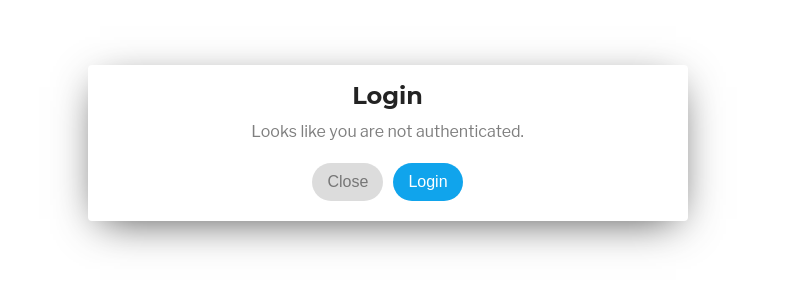

# WP Subero Modal
Beautiful interactive modals powered by a JavaScript class.

## Prerequisites
This is a WordPress plugin, so a WordPress installation is of course required.

* Basic JavaScript knowledge.
* Basic understanding of <a href="https://codex.wordpress.org/Plugin_API" target="_blank">WordPress Hooks</a> would help you to get the most out of this plugin.

## Install
Simply go to the <a href="https://github.com/isubero/wp-subero-modal/releases" target="_blank">releases</a> tab and **download the zip file** of the latest one. Install as any other WordPress plugin.

## Quick Example
Display a modal anywhere on your site:



``` javascript
let myModal = new SuberoModal({
    title: "This is the modal title",
    message: "You can use <b>html tags</b> here.",
});

myModal.show();
```

## Options
All arguments are optional, however, you would want to declare at least a `title` and a `message` to display within the modal.

* **layout** String: vertical | horizontal. Default "vertical".
* **id** String: Sets the id attribute for the main modal Div.
* **title** String.
* **message** String (Accepts HTML tags).
* **closeIcon** Bool: Default true.
* **confirmButton** Object
  * text (String)
  * callback (Function)
  * hideOnClick (Bool) wheather to close the modal or not when this button is clicked. Default: true.
* **cancelButton** Object
  * text (String)
  * callback (Function)
  * hideOnClick (Bool) wheather to close the modal or not when this button is clicked. Default: true.
* **image** Object.
  * src (String - The url of the image)
  * width (Integer)
  * height (Integer)
  * classes (Array with aditional classes for the image)
* **banner** Object (Shows on the left column when layout is set to 'vertical').
  * src (String - The url of the image)
  * width (Integer)
  * height (Integer)
  * classes (Array with aditional classes for the image)

## Methods
There are just two simple methods: `show()` and `hide()`. You probably already guessed what they do.

## Example with image


``` javascript
let exampleModal = new SuberoModal({
    image: {
      src: "your-image-url-here.jpg"
    },
    title: "A modal with an image",
    message: "This is looking good.",
    confirmButton: {
      text: "Ok, I accept",
      callback: function() {
        alert("This is a custom callback!");
      }
    },
    cancelButton: {
        text: "No, thanks"
    }
});

// Fire it up!
exampleModal.show();
```

The `hide()` method is called automatically after the confirm or cancel button is clicked, however you may call `show()` and `hide()` methods at will.

## WordPress example
Once you installed the plugin, simply use the appropriate WordPress Hook for your modal. For the sake of simplicity, let's use the `wp_footer` hook and display a modal if the user is not authenticated.

``` php
add_action('wp_footer', 'my_modal');

function my_modal() {
  
  if ( !is_user_logged_in() ) : ?>
    <script>
      // Make sure DOM is ready (SuberoModal class has loaded)
      document.addEventListener("DOMContentLoaded", function(event) {
        
        let myModal = new SuberoModal({
            title: "Login",
            message: "Looks like you are not authenticated.",
            confirmButton: { 
              text: "Login",
              callback: function() { 
                window.location = "www.yoursite.com/wp-login.php";
              }
            },
            cancelButton: { text: "Close" }
        });

        // Display the modal
        myModal.show();
      });
    </script>
  <?php endif;
}
```
Now open an incognito window or logout from your session to view the modal.



## A word on callbacks
Buttons callbacks are a very helpful feature of this modal, you can define any JavaScript function to be executed when the user clicks on the confirm/cancel buttons. I've used it for applying a WooCommerce coupon via Ajax, recolecting votes on simple polls, redirecting users to promo landing pages, basically anything you can think of.


## Thanks for your feedback
That's pretty much it for now. Hope you enjoy it! You can reach me out on Twitter <a href="https://twitter.com/suberovski" target="_blank">@suberovski</a>.
